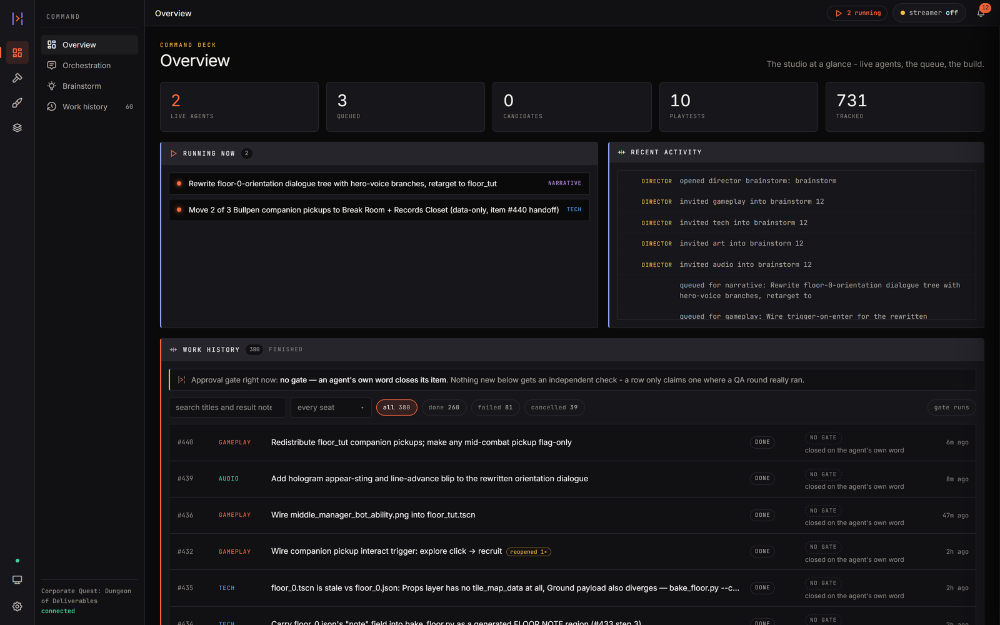
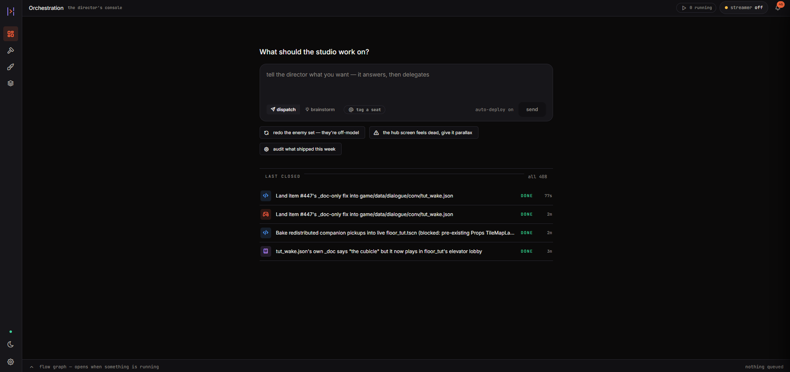
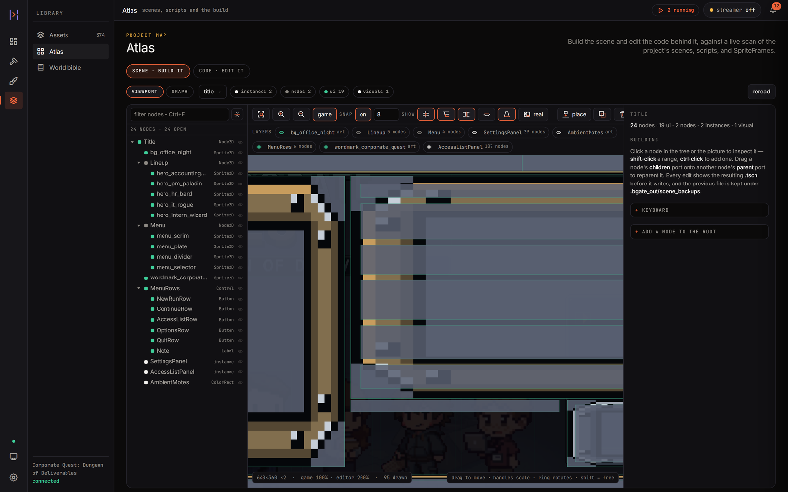
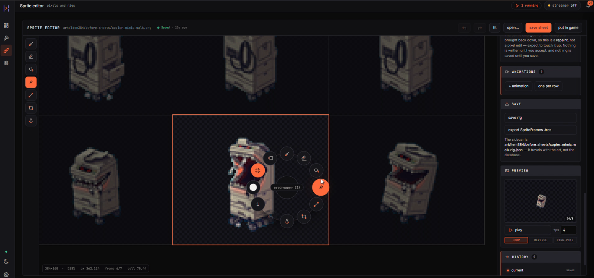
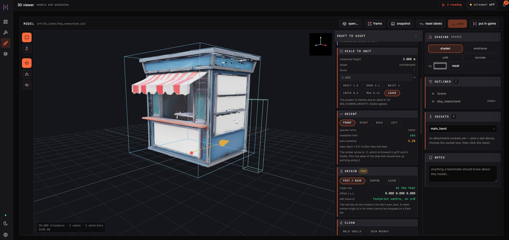
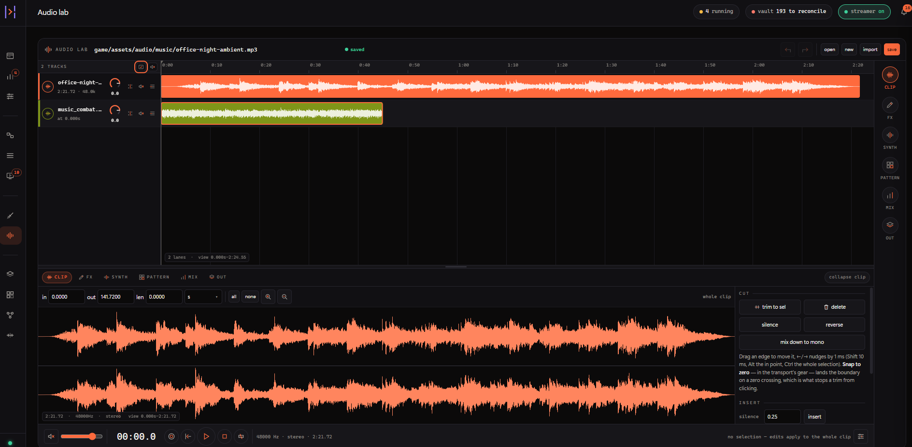
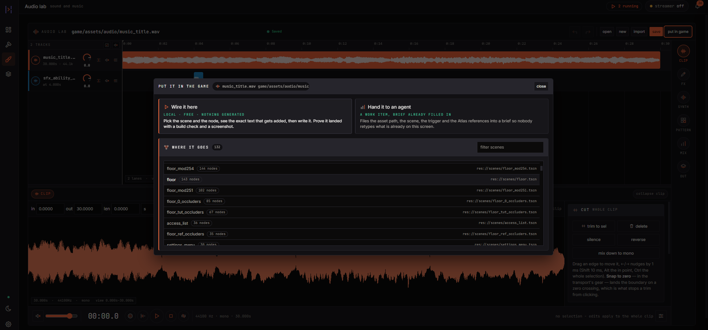
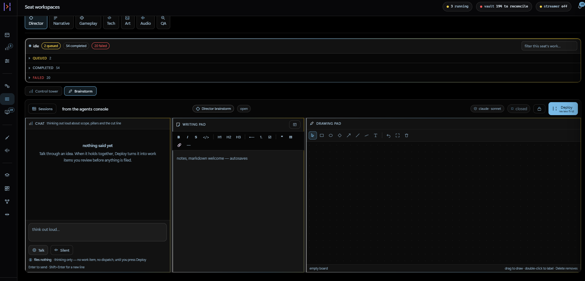

# Builders Gate

[](https://builders-gate.com)
[](https://www.python.org/downloads/)
[](docs/setup.md#platform-support)
[](LICENSE)
[](https://twitch.tv/thepizzzapie)

**An MCP server for building games with Claude Code.** It gives Claude 211
tools scoped to one game project: a design database, a work queue,
reference-pinned art and music generation, Godot and Blender adapters, and
playtest capture. All state lives in one SQLite file inside the project.

You run several Claude Code sessions at once, each holding a seat: art,
gameplay, narrative, QA, audio, tech. They share one database, so they do not
contradict each other, and file locks stop two of them editing the same asset. A
local dashboard shows what each one is doing and is where you dispatch work and
approve output.

Three limits are enforced in code: generation stops at a spend ceiling, a file
locked by one seat cannot be written by another, and no agent approves its own
art.

**For:** people running Claude Code on a game who want more than one session
working on it at once. It is more machinery than a small project needs.

**Platform:** Windows. Linux is best-effort and macOS is untested.

<p align="center">
  
</p>

## What is in the repo

| Path | What it holds |
|---|---|
| [`bgate_core/`](bgate_core/) | The domain. Database, seats, queue, locks, bible and lore, spend ledger, playtest, quests, decisions |
| [`bgate_mcp/`](bgate_mcp/) | The MCP server Claude connects to, plus the small read-only server the brainstorm room runs on |
| [`bgate_ui/`](bgate_ui/) | The dashboard's FastAPI backend: routes, agent dispatch, the steer pump. `static/` is built output |
| [`frontend/`](frontend/) | The dashboard's whole UI. `src/` is the React shell, `public/` the classic modules it has not replaced yet |
| [`bgate_cli/`](bgate_cli/) | `bgate init`, `adopt`, `serve`, `doctor`, `publish`, and the PreToolUse hook |
| [`bgate_adapters/`](bgate_adapters/) | Godot, Blender, and the image, music and speech providers |
| [`bgate_site/`](bgate_site/) | `bgate publish`: turns the games on a machine into a static arcade |
| [`templates/`](templates/) | The Godot projects `bgate init` unpacks, 2D and 3D |
| [`tests/`](tests/) | 5,300 tests. `-m "not slow"` skips the ones that drive real Blender and whisper |
| [`bgate_engine/`](bgate_engine/) | A design note with schemas and no runtime code. Nothing imports it |

## The screens

Orchestration is where you say what you want. The director answers, splits the
work across seats and dispatches it, and what closed is listed underneath.

<p align="center">
  
</p>

The scene editor reads the project's real `.tscn` files and writes them back,
with the playable build beside it.

<p align="center">
  
</p>

A sprite editor with frame detection, rig labels and per-frame regeneration.

<p align="center">
  
</p>

A 3D viewer for `.glb`, `.gltf` and `.obj`, which measures scale, orientation
and origin against the project's units. Its attachment sockets use the same slot
names as the sprite rig, so `main_hand` means one thing in 2D and 3D.

<p align="center">
  
</p>

An audio lab with lanes, clip editing and a step sequencer.

<p align="center">
  
</p>

Every editor ends at the same door: wire the asset into a scene yourself and see
the exact text that gets added, or file it as a work item with the path, the
scene and the trigger already in the brief.

<p align="center">
  
</p>

Brainstorm is a room you can invite seats into. Each one answers as its craft,
holding no tools that can write to the game. Nothing is queued until you file a
plan.

<p align="center">
  
</p>

[More screenshots](docs/screenshots.md), including the three themes.

## Requirements

- Python 3.11+
- An MCP client. [Claude Code](https://claude.com/claude-code) is what it is
  developed against
- [Godot 4.x](https://godotengine.org), plus the Web export templates for
  `bgate publish`
- Optional: [Blender 4.2+](https://blender.org), `ffmpeg` and `ffprobe` for
  playtest capture, `faster-whisper` and `sounddevice` for transcription
- Optional: `OPENAI_API_KEY` or `KREA_API_KEY` for art, `KIE_API_KEY` for music,
  `DEEPGRAM_API_KEY` for speech. All can be set from the dashboard

Detail, including the key table and platform notes: [`docs/setup.md`](docs/setup.md).

## Install

```bash
git clone https://github.com/Thepizzapie/BuildersGate
cd BuildersGate
pip install -e .                          # or: pip install -e ".[dev,stt,record]"

bgate doctor                              # what is installed and what is missing
bgate init emberfall --kind 2d            # a project AND a runnable game
cd emberfall
bgate serve                               # dashboard on http://127.0.0.1:7788
```

`bgate init` creates a new directory named after the project rather than
scaffolding into the one you are standing in. `bgate adopt` points it at a Godot
project you already have and never rewrites a file you wrote.

`bgate doctor` exits 1 if anything on its list is missing, including rows nobody
needs on day one. Read the rows, not the exit code: `python` and `godot` green is
enough to start.

### Register it with Claude Code

```bash
python -c "import sys; print(sys.executable)"    # the env where pip install ran
claude mcp add builders-gate --scope user -- <abs-python> -m bgate_mcp.server
bgate hook-install <game-project>                # lane and lock enforcement
```

Use the absolute python path. The claude CLI resolves a bare `python`
differently than your shell and reports "failed to connect" for a server that
runs. Restart Claude Code before the tools appear; if `project_status` is not in
the tool list, the server is not connected.

### Commands

| Command | What it does |
|---|---|
| `bgate serve` | The dashboard in a browser tab |
| `bgate app` | The same dashboard in a native window (`pip install -e ".[desktop]"`) |
| `bgate adopt` | Point it at an existing Godot project |
| `bgate projects` / `bgate use <name>` | List projects, switch the active one |
| `bgate publish` | Build a static arcade site from every game on the machine |
| `bgate key set openai --global` | Store an API key outside any repository |
| `bgate hook-status` | Prove the enforcement hook is live |
| `bgate panic` | Stop every agent on a project |

There is also a `BuildersGate-windows.zip` on the
[releases page](https://github.com/Thepizzapie/BuildersGate/releases) for people
who do not want Python. It is unsigned, so Windows warns about it; each release
ships a `.sha256` beside the zip. If you have Python, `pip install` avoids this
and `bgate app` gives you the same window.

## The working loop

After `bgate init`, everything is an MCP tool call, so any Claude session with
the server registered can drive it. One agent per seat, each adopting its role
through `BGATE_SEAT`.

```text
1  bgate init <name>       .bgate/game.db and a runnable game
2  DIRECTOR seat           bible_add: pillars, the core loop, constraints
3  NARRATIVE seat          lore_add / lore_fact, canon_check before a write lands
4  ART seat                ref_pin first, then generate; asset_lock around binaries
5  GAMEPLAY seat           code in its lanes; godot_check_project and godot_run
6  QA seat                 headless tests via godot_run; asset_verify for drift
7  playtest_start          play it, talk out loud; you promote what becomes work
```

Four rules keep multi-agent work safe: check `seat_can_write` before writing
outside your lane, lock binaries before editing them, run `canon_check` before a
narrative write lands, and `queue_add` anything another seat has to do.

`seat_brief(role)` returns what a seat needs to start: mission, lanes, bible,
canon, pinned references, and who holds which locks. Every tool takes an optional
`project_dir`, falling back to `BGATE_ROOT` and then to the nearest `.bgate/`.

## Project status

First public release 2026-07-27. A solo project, proven against a small number of
games on one Windows machine.

| State | What |
|---|---|
| Covered by tests and daily use | The MCP server and its tools. Seats, lanes, locks, the hook. The Godot adapter. Both image providers. The dashboard. Playtest capture. `bgate publish` |
| Works, proven by hand | The Blender adapter and the glTF round trip. Its tests are `slow`-marked or skip without Blender. Nothing here generates 3D geometry |
| Newer | Music through kie.ai, Deepgram speech, the streamer chat integration, the local-runtime panels |
| Uneven | Error surfacing in the dashboard. Godot version detection reports "unknown" on some builds |
| Not a product | [`bgate_engine/`](bgate_engine/) is a design note. Its central claim was withdrawn after the experiment in its own `DESIGN.md` came back negative |

## Docs

[`docs/README.md`](docs/README.md) indexes everything.

| Page | What it is |
|---|---|
| [start-here.md](docs/start-here.md) | The front door. Assumes nothing |
| [glossary.md](docs/glossary.md) | Every term this project uses narrowly |
| [setup.md](docs/setup.md) | Requirements, keys, adopt, MCP registration, platforms |
| [reference.md](docs/reference.md) | Every surface in detail |
| [design-notes.md](docs/design-notes.md) | Budgets, approval, canon, technology choices |
| [gotchas.md](docs/gotchas.md) | GPU cold starts, stdio deadlocks, telemetry clocks |
| [screenshots.md](docs/screenshots.md) | The dashboard, view by view |
| [lessons-from-a-shipped-game.md](docs/lessons-from-a-shipped-game.md) | What a shipped game cost, and the rules that came out of it |

## Working on it

```bash
pip install -e ".[dev]"
ruff check .
python -m pytest -m "not slow" -q
```

Both are merge gates in CI. The front end is built separately and its output is
committed, so a plain `pip install` needs no toolchain:

```bash
cd frontend && npm install && npm run build
```

See [CONTRIBUTING.md](CONTRIBUTING.md) for the full set of checks.

## Streams and community

Builders Gate is built on stream at
[twitch.tv/thepizzzapie](https://twitch.tv/thepizzzapie), using the tool to make
a game, which is how most of its gates get found.

**Streamer mode** (Settings, Privacy) hides absolute paths, your username,
hostname and every API key from the dashboard, the logs and the CLI, so the
screen is safe to show.

**Feedback sessions** bring the stream's chat into the dashboard. While one is
open, chat's reactions and notes are captured against the build you are playing.
Closing it hands the session to the director, which turns it into notes you can
brainstorm from or dispatch a team against. Channel configuration is read from
the environment, so a public checkout carries the feature and none of the
account.

## Security

The dashboard binds to `127.0.0.1`, and that is not a boundary on its own: any
page you have open can POST to localhost. Three checks sit on the mutating
surface. A **host allowlist** that closes DNS rebinding, which the other two
cannot see. **Same-origin** checks on `sec-fetch-site` and `Origin`. And a
**per-project bearer token**, minted into `.bgate/ui-token` (0600, gitignored)
and required on every mutation.

Approval is human-only throughout. A dispatched agent carries
`BGATE_ACTOR=agent:item-<id>` and is refused the bible, the budget, the revert,
workflow gates, and promoting a candidate into the build.

What it does not protect against, stated plainly: a hostile local user (anything
that can read `.bgate/` has the token), a hostile prompt or project (lanes and
locks are coordination, not a sandbox), exposure to a network (no roles, no
multi-user model, do not put it behind a proxy), and untrusted input to the
adapters, since executing the GDScript you hand `godot_run` is the feature.

[SECURITY.md](SECURITY.md) has the whole threat model. Report vulnerabilities
through GitHub Security Advisories, not a public issue.

The standalone Windows build is unsigned, so Defender and Smart App Control both
object; only an Authenticode certificate fixes that. Every release ships a
`.sha256` beside the zip so you can check the download against what CI built.

## Contributing and licence

Feedback is worth more than patches here, especially "it did not run on my
machine" and "this gate can be walked around". See
[CONTRIBUTING.md](CONTRIBUTING.md) and [CHANGELOG.md](CHANGELOG.md).

MIT. See [LICENSE](LICENSE).
