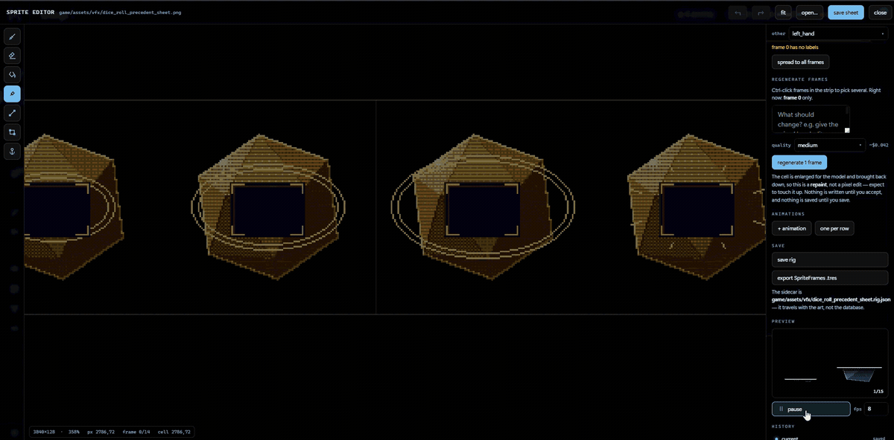
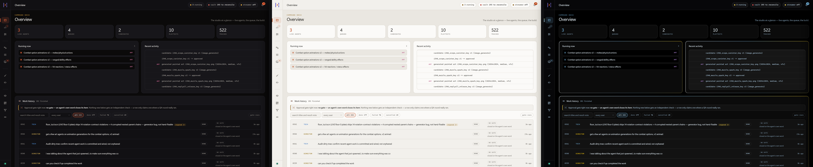

# Builders Gate

[](https://builders-gate.com)
[](https://www.python.org/downloads/)
[](docs/setup.md#platform-support)
[](LICENSE)
[](https://twitch.tv/thepizzzapie)

**Builders Gate is an MCP server for building games with Claude Code.** It gives
Claude close to 200 tools scoped to one game project: a design database, a work
queue, reference-pinned art and music generation, Godot and Blender adapters, and
playtest capture. All state lives in one SQLite file inside the project.

**Who it is for:** people running Claude Code who are building a game and want
more than one session working on it at once. It is more machinery than a small
project needs.

**Platform:** Windows is supported. Linux is best-effort, because parts of the
product shell out to Windows tooling and the suite is not kept green there.
macOS is untested.

Start with [Install and quickstart](#install-and-quickstart), or read
[`docs/start-here.md`](docs/start-here.md) if the vocabulary is new.

## What it does

You run several Claude Code sessions at once, each assigned a role: art,
gameplay, narrative, QA, audio, tech. They read and write the same database, so
they do not contradict each other, and they cannot edit the same files at the
same time. A local dashboard shows what each one is doing, and is where you
dispatch work and approve output. Your own Claude session uses the same tools and
the same database, so asking what is left before the vertical slice reads the
queue and the design bible, not the chat history.

Three limits are enforced in code: generation stops at a spend ceiling, files
locked by one seat cannot be written by another, and no agent can approve its own
art.

Local-first. No daemon, no cloud, no build step in the frontend.

<p align="center">
  
</p>

<p align="center"><em>The dashboard, running against a real project.
<a href="docs/screenshots.md">More screenshots →</a></em></p>

### The editors

The scene editor reads the project's real `.tscn` files and writes them back,
with the playable build beside it, so a change and its result are on one screen.

<p align="center">
  
</p>

There is also a sprite editor with frame detection, rig labels and per-frame
regeneration, an audio lab with lanes, clip editing and a step sequencer, and a
3D viewer for `.glb`, `.gltf` and `.obj` meshes. The viewer's attachment sockets
use the same slot names (`main_hand`, `head`) as the sprite rig, so gear
placement means one thing whether the character is 2D or 3D. All of these are
pages in the dashboard, not a trip out to another program.

<p align="center">
  
</p>

### Talk it through before dispatching

Brainstorm is a conversation with a writing pad and a drawing pad beside it.
Nothing is queued until you press Deploy, which turns the session into work items
you review first.

<p align="center">
  
</p>

### Three themes

<p align="center">
  
</p>

> **Setting this up with Claude?** Point it at [`CLAUDE.md`](CLAUDE.md) in this
> repo. It is written for an assistant doing the install on your behalf,
> including the two mistakes that waste the most time.
>
> **New to this?** Start at [`docs/start-here.md`](docs/start-here.md), which
> assumes nothing and defines the vocabulary once. Unfamiliar term?
> [`docs/glossary.md`](docs/glossary.md).

## Requirements

- Python 3.11+
- An MCP client. [Claude Code](https://claude.com/claude-code) is what it is
  developed against
- [Godot 4.x](https://godotengine.org). Add the Web export templates if you want
  `bgate publish`
- Optional: [Blender 4.2+](https://blender.org) for the 3D leg, `ffmpeg` and
  `ffprobe` for playtest capture, `faster-whisper` and `sounddevice` for
  transcription
- Optional: an `OPENAI_API_KEY` or `KREA_API_KEY` for generated art, a
  `KIE_API_KEY` for generated music, a `DEEPGRAM_API_KEY` for speech. All can be
  set from the dashboard instead of by editing a file

Full detail, including the API key table and the platform notes:
[`docs/setup.md`](docs/setup.md).

## Install and quickstart

You need Python 3.11 or newer on `PATH`. Check with `python --version`. Use a
virtual environment if you can, because `pip install -e .` otherwise puts
Builders Gate and its dependencies in your system Python.

```bash
git clone https://github.com/Thepizzapie/BuildersGate
cd BuildersGate
pip install -e .                          # or: pip install -e ".[dev,stt,record]"

bgate doctor                              # python/key/ffmpeg/blender/godot/whisper
bgate init emberfall --kind 2d            # a project AND a runnable game
cd emberfall
                                          # optional: drop a .env here with your
                                          # image key, see .env.example
bgate serve                               # dashboard on http://127.0.0.1:7788
```

`bgate init` creates a NEW directory named after the project, not whatever
directory you are standing in. It writes `.bgate/game.db`, unpacks the Godot
template, and prints the absolute path. `bgate serve` with no project shows a
first-run screen that does the same thing from the browser.

**If `bgate` is "not recognized" on Windows**, the install worked and Python's
`Scripts\` directory is not on your `PATH`. Two ways through:

1. Call the CLI as `python -m bgate_cli.main doctor`. Every command works that
   way; `bgate` is only a shortcut.
2. Re-run the Python installer, choose Modify, tick **Add Python to PATH**, then
   open a new terminal, because `PATH` is read at shell start.

### Reading `bgate doctor`

It exits 1 if **anything** on its list is unavailable, including rows nobody
needs on day one. Read the rows, not the exit code:

| Row | Needed for |
|---|---|
| `python`, `godot` | **Required.** The core loop: a project, a build, a run |
| `blender` | Optional. The 3D leg only |
| `ffmpeg`, `ffprobe` | Optional. Playtest capture and cutscene transcoding |
| `whisper` | Optional. Voice transcription during playtest |
| `art_key`, `local_image` | Optional. Generated art, from a rented key or a local model |
| everything else | Optional. Capability inventory, not a gate |

A red optional row is a feature you do not have yet, not a broken install. If
`python` and `godot` are green, keep going.

### Let agents drive it

```bash
python -c "import sys; print(sys.executable)"    # <abs-python>, from the env
                                                 # where pip install -e . ran
claude mcp add builders-gate --scope user -- <abs-python> -m bgate_mcp.server
bgate hook-install <game-project>         # lane/lock teeth
```

Use the ABSOLUTE python path, which is what the `python -c` line prints. The
claude CLI's health check resolves a bare `python` differently than your shell
and reports "failed to connect" against a server that runs fine.

**Restart Claude Code before the tools appear.** A running session does not pick
up a newly registered MCP server; a fresh one does. If `project_status` is not in
the tool list after restarting, the server is not connected.

### Other entry points

Covered in [`docs/setup.md`](docs/setup.md):

| Command | What it does |
|---|---|
| `bgate app` | The dashboard in a native window instead of a browser tab |
| `bgate adopt` | Point it at a Godot project you already have. Additive only, never rewrites a byte you wrote |
| `bgate projects` | List every known project |
| `bgate use <name>` | Switch the active project without exporting `BGATE_ROOT` |
| `bgate publish` | Turn every game on the machine into a static arcade site |
| `bgate hook-status` | Prove the enforcement hook is live |
| `bgate key set openai --global` | Store an API key outside any repository |
| `bgate un-adopt <dir>` | Remove `.bgate/` from a project. Needs `--yes` |

### Desktop app

`bgate app` runs the same server as `bgate serve` in a native window. On Windows
that is the Edge WebView2 runtime shipped with Windows 11, so there is nothing
extra to install:

```bash
pip install -e ".[desktop]"
bgate app
```

It binds to a loopback port the OS picks, so it will not collide with a
`bgate serve` you already have open, and it shuts the server down when you close
the window.

### The standalone Windows build, and why it warns

There is a `BuildersGate-windows.zip` on the
[releases page](https://github.com/Thepizzapie/BuildersGate/releases) for people
who do not want Python at all. Unzip it and run `BuildersGate.exe`: double-click
for the window, or `BuildersGate.exe serve` for the browser dashboard.

The binary is not code signed, so Windows objects in two ways:

- **Defender** flagged the first build as `Trojan:Win32/Sabsik.TE.A!ml`. The
  `!ml` suffix is a machine-learning guess, not a signature match. That build
  used PyInstaller's `--onefile`, which unpacks into `%TEMP%` and executes code
  from it, which looks like a dropper. It ships as a plain folder now, which
  removes the trigger.
- **Smart App Control**, default-on for clean Windows 11 installs, refuses to
  launch unsigned binaries at all: *"we can't confirm who published
  BuildersGate.exe."* Repackaging does not fix that. It needs an Authenticode
  certificate, which is
  [being worked on](https://github.com/Thepizzapie/BuildersGate/issues).

Every release publishes a `.sha256` next to the zip so you can check the download
against what CI built. Both come from
[`.github/workflows/release-exe.yml`](.github/workflows/release-exe.yml) on a
tagged commit.

**If you have Python, `pip install` avoids all of this.** `bgate app` gives you
the same native window as an ordinary Python process.

To build the standalone yourself:

```bash
pip install -e ".[desktop]" pyinstaller
python packaging/build_exe.py
```

That writes `dist/BuildersGate/`, boots it to check it serves its own assets, and
only then zips it. The boot check matters: the app finds `static/` and
`templates/` by walking up from `__file__`, so a bundle that lays them out wrongly
still starts, still renders the shell, and 404s every stylesheet. A green
PyInstaller run does not mean a working binary.

## The working loop

Step 1 is `bgate init`. Everything after it is an MCP tool call, so any Claude
session with the server registered can drive it. The intended shape: you or an
orchestrator fan out one agent per seat, each adopting its role via `BGATE_SEAT`.

```text
1  bgate init <name>       .bgate/game.db + a runnable game, path printed
2  godot_scaffold          (or, into an existing project: the same runnable slice)
3  DIRECTOR seat           bible_add: pillars, the core loop, constraints, references
4  NARRATIVE seat          lore_add / lore_fact; canon_check on every narrative write
5  ART seat                ref_pin approved references first, then blender_sprites /
                           image_sprites / image_generate; asset_lock before touching
                           any binary, asset_release after
6  GAMEPLAY seat           writes code in its lanes; godot_check_project + godot_run
                           after every change; godot_screenshot to SEE the game
7  QA seat                 headless test scripts via godot_run; asset_verify for drift
8  playtest_check/start    play it yourself, talk out loud; feedback lands classified
                           and joined to telemetry; YOU promote what becomes work
```

Four rules make multi-agent work safe:

1. Check `seat_can_write` before writing outside your obvious lane.
2. Lock binaries before editing them.
3. Run `canon_check` before any narrative write lands.
4. When another seat has to DO something because of your work, `queue_add` it. A
   note is a bulletin, a queue item is a job.

`seat_brief(role)` returns everything a seat needs to start: mission, lanes,
bible, canon, pinned reference anchors, promoted feedback, and who holds which
locks.

Every tool takes an optional `project_dir`. It resolves the project from that,
then `BGATE_ROOT`, then by walking up from the cwd looking for a `.bgate/`
directory. Pass it explicitly whenever more than one project could be in play.

## Project status

2026-07-27, first public release. A solo project that has built real games on one
machine, which shows in both directions.

| State | What is in it |
|---|---|
| **Works, covered by tests and daily use** | The MCP server and its tools. Seats, lanes, asset locks, the PreToolUse hook. The Godot adapter: headless run and check, import with in-engine inspection, screenshots, scaffolds. Both image providers. The dashboard. Playtest capture through to a joined brief. `bgate publish`. `bgate doctor` |
| **Works, proven only by hand** | The Blender adapter and the glTF round trip. Tests exist but are `slow`-marked or skip when Blender is absent, so a normal test run says nothing about them. Nothing here generates 3D geometry |
| **Newer, less travelled** | Music generation through kie.ai's Suno API, run against the live service including failure paths, but days old rather than months. Same for Deepgram speech, the streamer chat integration, and the local-runtime and coding-agent setup panels, which detect what you have installed rather than starting or stopping it |
| **Half-built, and named as such** | The dashboard's error surfacing is uneven; a failed mutation still sometimes renders as nothing happening. Godot version detection reports "unknown" on some builds |
| **A proposal, not a product** | [`bgate_engine/`](bgate_engine/) is a design note with JSON schemas and **no runtime code**. Nothing in the repository imports it. Its central claim, a second authoritative simulation in Python, was **withdrawn** after the experiment in its own `DESIGN.md` §16.5 came back negative |

Most of this was proven against a small number of games on one Windows machine.
It has been through a harsh self-audit, and the top-10 blockers from it have
since been worked.

## Docs

[`docs/README.md`](docs/README.md) indexes everything with a line each.

**Start here**

| Page | What it is |
|---|---|
| [start-here.md](docs/start-here.md) | The front door. Assumes nothing |
| [glossary.md](docs/glossary.md) | Every term this project uses narrowly |

**Reference**

| Page | What it is |
|---|---|
| [setup.md](docs/setup.md) | Requirements, API keys, `adopt`, project switching, MCP registration, platform support |
| [reference.md](docs/reference.md) | Every surface in detail: dashboard, seats, locks, Blender to Godot, templates, publishing, playtest, layout |
| [design-notes.md](docs/design-notes.md) | Budgets, human-only approval, canon, and the technology choices |
| [gotchas.md](docs/gotchas.md) | GPU cold starts, stdio deadlocks, whisper segmentation, telemetry clocks |
| [screenshots.md](docs/screenshots.md) | The dashboard, view by view |

**Findings**

| Page | What it is |
|---|---|
| [lessons-from-a-shipped-game.md](docs/lessons-from-a-shipped-game.md) | What a real shipped game cost to make, and the rules that came out of it |
| [sprite-animation-research.md](docs/sprite-animation-research.md) | Why sprite sheets that passed every gate still animated badly |
| [cinematic-research.md](docs/cinematic-research.md) | The video-model landscape and the Godot format wall that swallows a finished cutscene |
| [visual-taste-research.md](docs/visual-taste-research.md) | What is computable about art quality, and what is not |

## Working on Builders Gate itself

```bash
pip install -e ".[dev]"
ruff check .
python -m pytest -m "not slow" -q
```

Both are merge gates in CI. `-m "not slow"` deselects the tests that drive real
Blender, real whisper, and the in-suite wheel build. Drop it only if you have
those installed and want to wait. See [CONTRIBUTING.md](CONTRIBUTING.md) for the
full set of checks.

## Dev streams

Builders Gate is built on stream at
[twitch.tv/thepizzzapie](https://twitch.tv/thepizzzapie), using the tool to make
a game with it, which is how most of these gates get found. Streamer mode
(Settings → Privacy) hides absolute paths, your username, hostname and any API
key from the dashboard, the logs and the CLI.

It also brings the stream's chat into the dashboard and can run a **feedback
session**: while one is open, chat's reactions and notes are captured against the
build, and closing it hands the session to the director, which synthesises it
into notes you can brainstorm from or dispatch a team against. Channel
configuration is read from the environment, so a public checkout carries the
feature and none of the account.

## Contributing, security, licence

Feedback is worth more here than patches, especially "it did not run on my
machine" and "this gate can be walked around". See
[CONTRIBUTING.md](CONTRIBUTING.md) for what to include in a report, and
[CHANGELOG.md](CHANGELOG.md) for the release state.

This tool executes arbitrary GDScript, shells out, and spawns agent sessions with
edit permissions. [SECURITY.md](SECURITY.md) states what the localhost guards do
protect against (a browser page reaching your dashboard, including via DNS
rebinding) and what they do not (a hostile local user, a network deployment,
untrusted input to the adapters). Report vulnerabilities privately through GitHub
Security Advisories, not a public issue.

MIT. See [LICENSE](LICENSE).
