# Screenshots

All captured against a real project, *Corporate Quest: Dungeon of Deliverables*,
with 293 tracked assets, 28 lore entities and a live queue. Nothing here is a
mockup or an empty state dressed up.

The dashboard is served locally by `bgate serve` (browser) or `bgate app`
(native window). No build step, no CDN, no framework.

---

## Command deck

The studio at a glance: what is running, what is queued, what was captured.


Dispatch work to a seat, then watch and steer it while it runs.


---

## Light and dark

The whole app has two grounds. It follows the OS unless you pick one, and the
choice is applied before first paint so there is no flash on load.

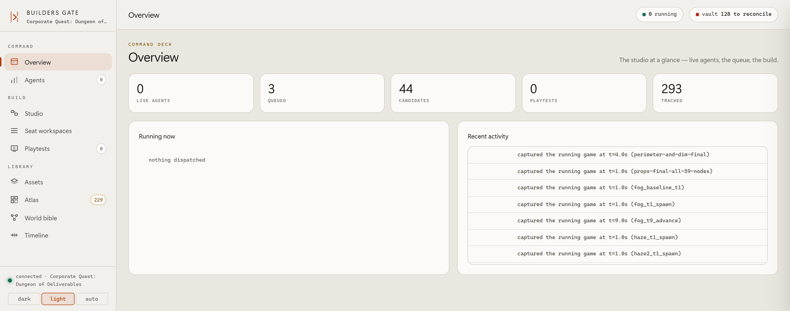

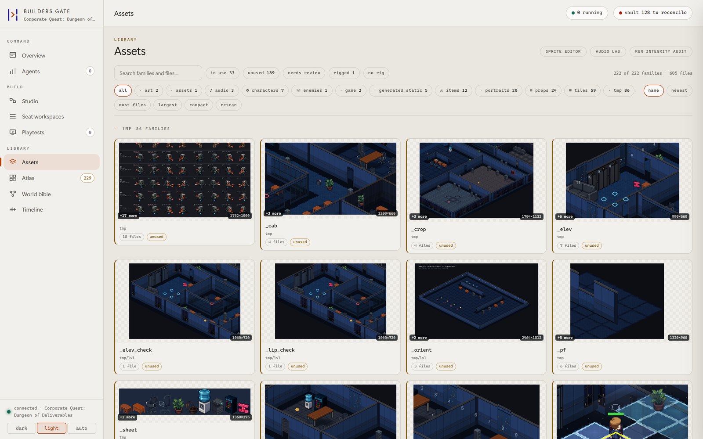

---

## Library

Every asset the project has, grouped and filtered, with generated candidates
waiting for review.

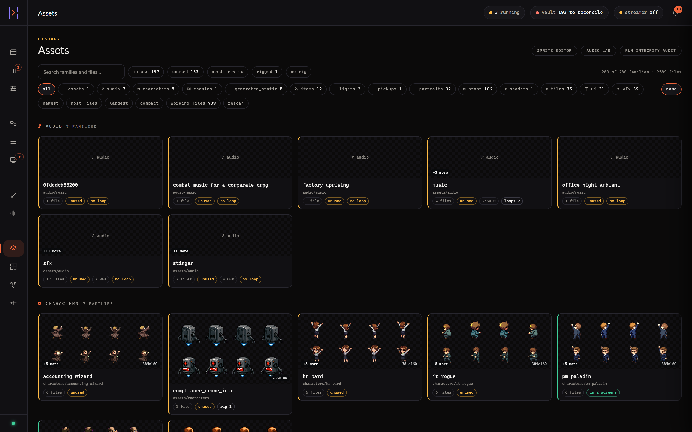

Every screen wired to every asset it uses, derived live from the scenes,
scripts and SpriteFrames.


The playable build sits beside the tree. An edit, a rebuild and the result are
one screen rather than three programs.

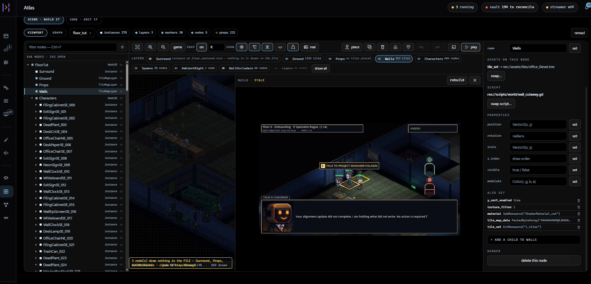

---

## Brainstorm

A conversation with a writing pad and a drawing pad beside it. Nothing is queued
until you press Deploy, and Deploy shows you the plan and the agents it would
dispatch before anything is filed.


---

## Seat workspaces

Each of the eight seats gets a workspace tuned to its craft. The director's is a
queue board and a live agent board.

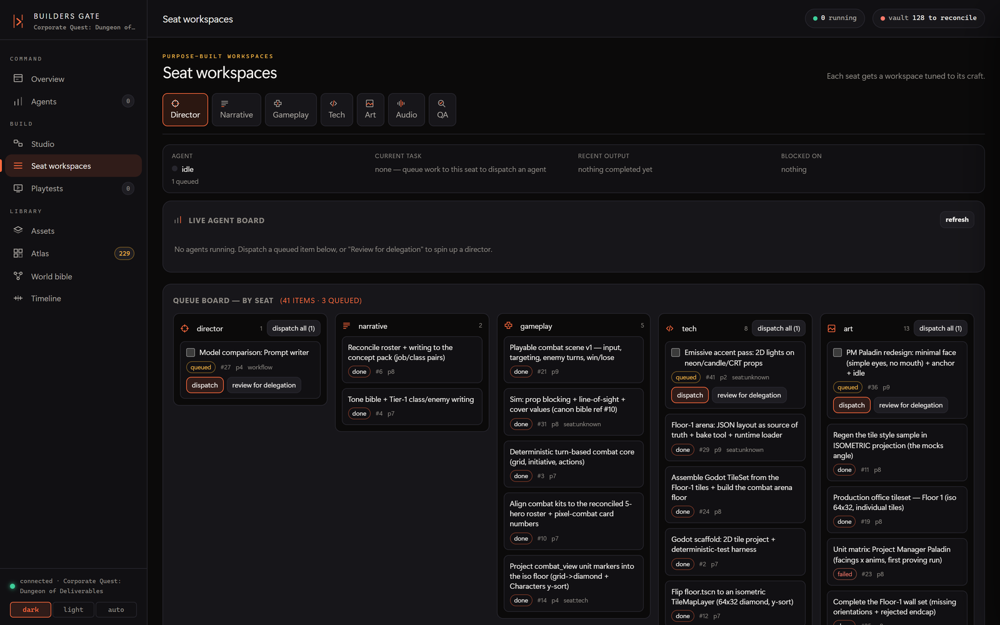

QA's is bot rosters and recorded verdicts.

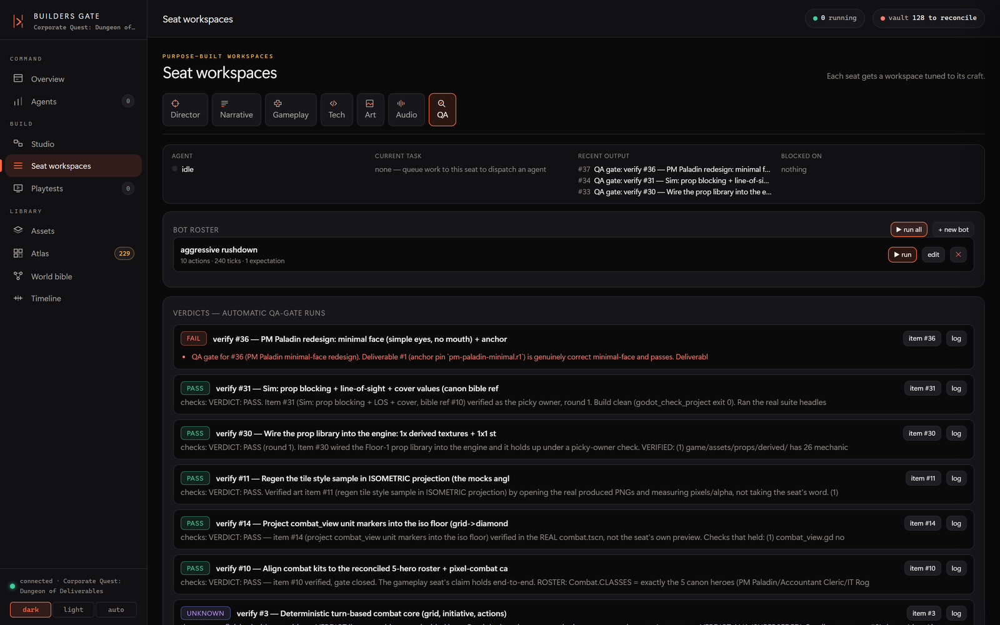

---

## Studio

Visual node editors. The workflow builder:

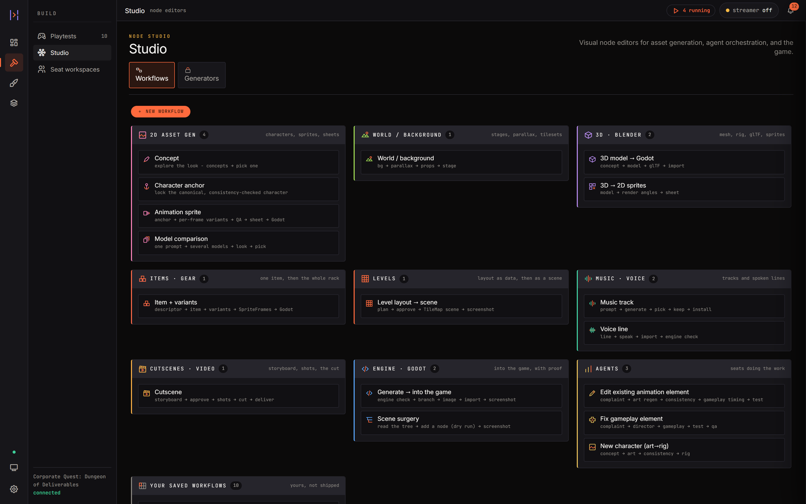

The agent flow, queued tasks wired to the seats that will run them:

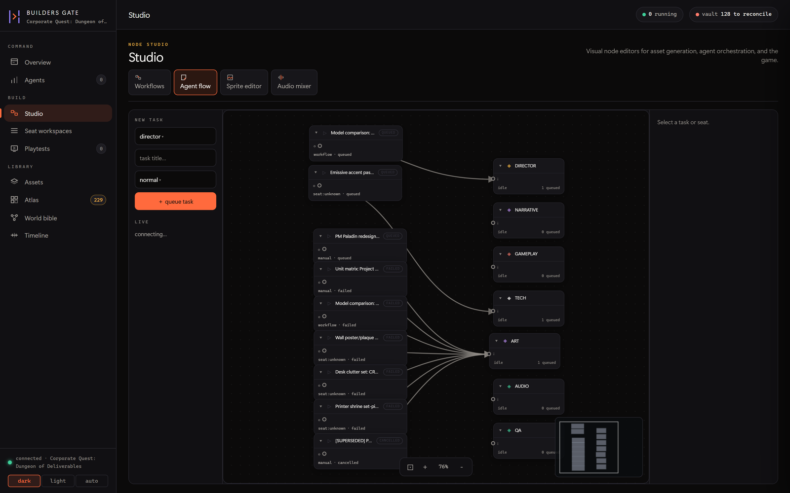

### Sprite editor

Pixel editing with the sheet grid detected, per-frame navigation, a named edit
history you can step back through, a looping preview, and onion skin showing
the frames *before and after* the one you are painting.


Ctrl+right-click anywhere on the canvas raises the tools around the cursor, so
the common operations stop being a trip to the edge of the screen.

### Audio lab

Clip editing with a real selection: numeric in/out, snap to zero crossing, a
gain slider, fade curves, and A/B against the original before you commit.


Layers mode puts each source on a shared timeline, dragged to position, with
per-lane mute and solo, split at the playhead, and non-destructive trim.

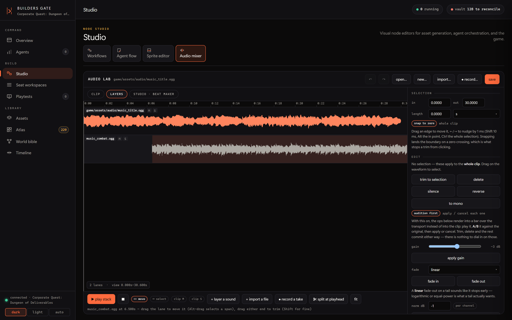

---

## World bible

The lore graph. Entities carry long-form bodies, canon status and
relationships, and the relationships are drawn rather than only stored.

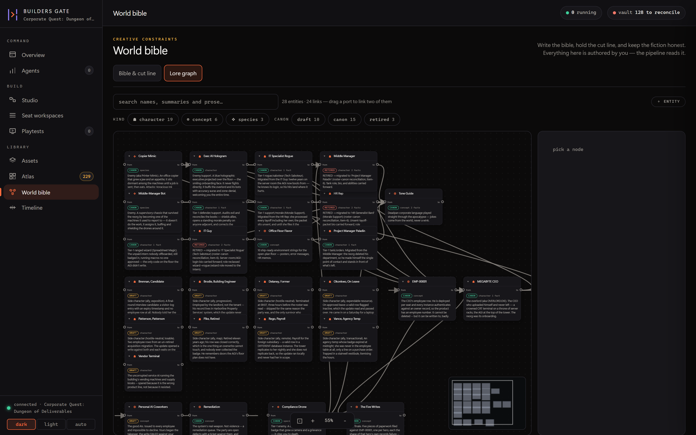

---

## Playtests

Recorded sessions: video, transcript, telemetry and the director's triage, all
on one clock.

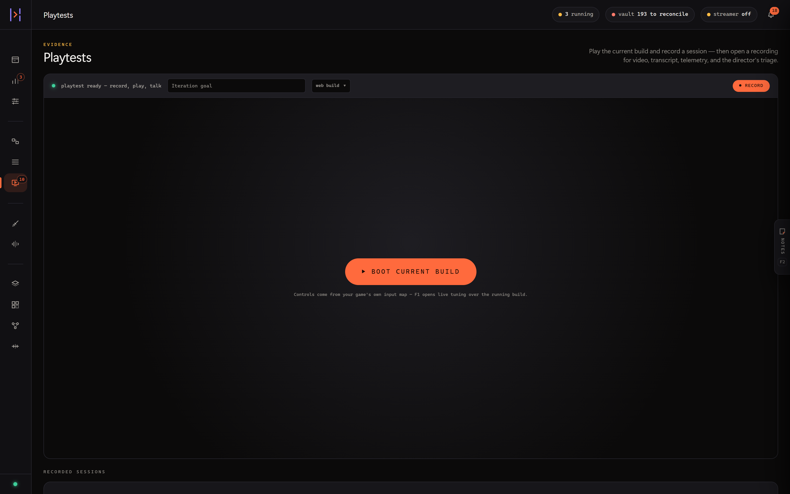

---

## Themes

Dark, light, and orbit. Orbit is the opinionated one: glass over a true black
ground with an iridescent rim.


---

## Regenerating these

[`capture_screenshots.py`](capture_screenshots.py) drives a running dashboard
headlessly, so most of these can be refreshed rather than re-staged by hand:

```bash
pip install playwright          # no browser download needed; it drives Edge
bgate serve                     # in another terminal, against a real project
python docs/capture_screenshots.py
```

It shoots at 1600x1000 with a device pixel ratio of 2 and halves the result, and
it resizes the viewport to each view's own height first so a short page is not
padded with empty canvas. Each view is switched in page (`setWorkspace`,
`Studio.select`, `SeatShell.select`) rather than by URL, with a per-shot wait
before the capture.

Two environment variables:

| Variable | Default | Why you would change it |
|---|---|---|
| `BGATE_URL` | `http://127.0.0.1:7788` | a dashboard on another port, for example `bgate serve --port 7801` |
| `BGATE_SHEET` | `game/assets/characters/compliance_drone_idle.png` | the sprite-editor shot needs a sheet that exists in your project |

It writes fifteen files: `overview`, `agents`, `assets`, `atlas`,
`seat-workspaces`, `seat-qa`, `playtests`, `studio-workflows`,
`studio-agent-flow`, `sprite-editor`, `audio-lab`, `audio-layers`,
`world-bible`, `overview-light`, `assets-light`.

The audio-lab shots need sounds in the project. The script asks
`/api/audio/lab/list` and prefers `music_title` and `music_combat`, falling back
to whatever is there. An empty timeline shows nothing about what layers mode is
for, so the layers shot adds a second track and offsets it before shooting.

The script does not start a server, on purpose: screenshots of an empty project
are worth very little.

Four images here are staged by hand and are not regenerated by the script:
`atlas-play.png`, `brainstorm.png`, `themes.png` and the `sprite-editor.gif`
that replaced the script's `sprite-editor.png`.
